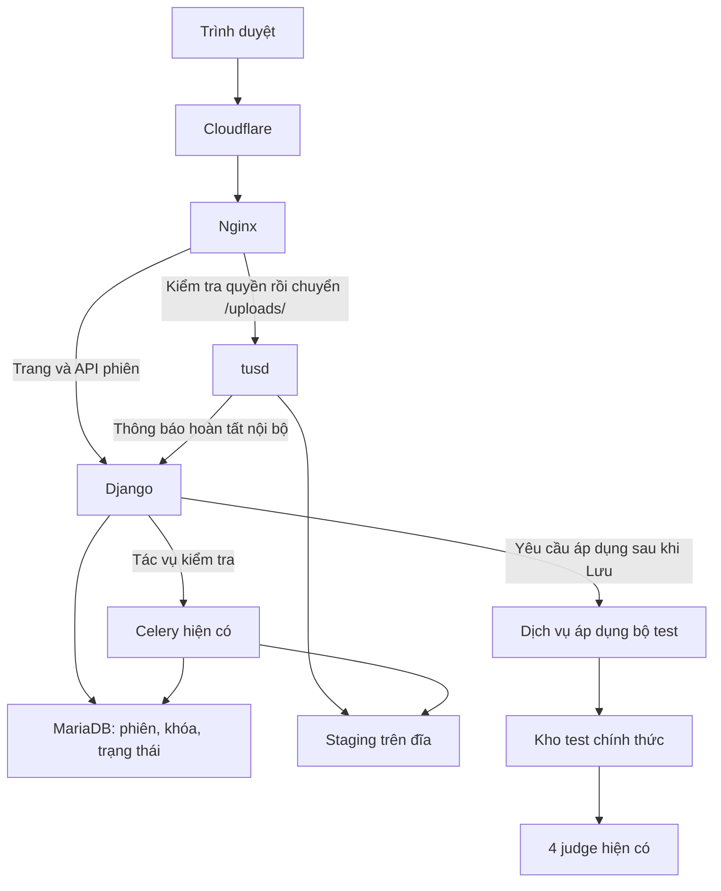

# Kế hoạch upload bộ test lớn qua Cloudflare

**Trạng thái:** Đã được người dùng duyệt triển khai. Code và kiểm thử local đã hoàn thiện; tính năng mặc định tắt, chưa triển khai lên production.

Người dùng đã duyệt phạm vi, mức đĩa dự phòng 5 GiB và thanh tiến trình upload. Hướng dẫn cài đặt nằm tại [runbook](../deployment/test-data-upload/README.md), bằng chứng và quy trình kiểm tra judge nằm tại [judge verification](../deployment/test-data-upload/judge-verification.md). Các bước qua Cloudflare thật và bốn container judge production còn là điều kiện nghiệm thu khi rollout.

## 1. Mục tiêu và phạm vi

Cho phép người có quyền sửa dữ liệu test upload ZIP lớn qua `utcoj.info`, có tiến trình, retry và tiếp tục khi gián đoạn. Khi upload hoặc lưu thất bại, bộ test đang sử dụng phải còn nguyên.

Các quyết định đã thống nhất:

- Chia file thành nhiều HTTP request nhỏ; giữ Cloudflare cho đường upload.
- Dùng tusd nhận file, Django quản lý quyền/phiên, Celery kiểm tra ZIP.
- Giữ filesystem và kho `/problems` hiện tại.
- Mỗi bài chỉ có một phiên sửa dữ liệu test; từ chối phiên thứ hai.
- Chưa triển khai quota theo user hoặc organization.
- Chỉ áp dụng ZIP mới khi người dùng bấm **Lưu** và cấu hình testcase hợp lệ.

Ngoài phạm vi phiên bản đầu:

- Chuyển test sang S3/MinIO hoặc mở subdomain bỏ Cloudflare.
- Upload song song nhiều phần của cùng một ZIP.
- Khóa việc sửa nội dung đề, editorial hoặc thông tin không liên quan đến dữ liệu chấm.
- Nâng cấp image judge hoặc đổi cách triển khai bốn judge nếu chưa có bằng chứng cần thiết.

## 2. Hiện trạng đã xác nhận

| Thành phần | Hiện trạng | Ảnh hưởng đến thiết kế |
| --- | --- | --- |
| Compose | `/opt/utcoj/deploy/compose.yaml` và `compose.override.yaml` | Giữ các thiết lập email và môi trường hiện có |
| Site | uWSGI, 4 process × 2 thread; Nginx dùng `site:8001` | Không giữ request upload lớn trong worker Django |
| Nginx | `client_max_body_size 48m` trong các server HTTPS phục vụ ứng dụng | Chunk 16 MiB nằm dưới giới hạn hiện tại |
| Celery | Một worker, `--concurrency=2` | Dùng lại worker; giới hạn tác vụ kiểm tra ZIP nặng |
| MariaDB/Redis | MariaDB 11.4, Redis 7 | MariaDB giữ trạng thái/khóa; xác minh cấu hình broker thực tế trước triển khai |
| Kho test | `/opt/utcoj/data/problems` được mount thành `/problems` cho site, Celery và bốn judge | Không cần sao chép test đến bốn máy khác nhau |
| Judge | ID riêng `utcoj-hanoi-judge-1..4`; storage `local`, glob `/problems/*` | Staging phải nằm ngoài vùng quét |
| Tài nguyên | 8 CPU, khoảng 30 GiB RAM, 122 GB đĩa trống tại lúc kiểm tra | Là số liệu thời điểm, không phải ngân sách tài nguyên dành riêng cho upload |
| `/tmp` | `/tmp` trên host là tmpfs; cấu hình trong container chưa xác nhận | Dùng bind mount staging rõ ràng |
| Scheduler | Compose được cung cấp chưa có Celery Beat | Cần cơ chế chạy cleanup riêng |

Frontend hiện chặn ZIP trên 100 MiB, đọc toàn bộ ZIP bằng `FileReader`/JSZip và gửi file trong form. Backend hiện lưu dữ liệu rồi sinh `init.yml`; đường lỗi trong compiler có thể xóa `init.yml`. Luồng này cần được tách thành chuẩn bị và công bố trước khi dùng cho upload mới.

## 3. Kiến trúc đề xuất



### Lưu trữ và mount

| Đường dẫn host | Đường dẫn container đề xuất | Bên truy cập |
| --- | --- | --- |
| `/opt/utcoj/data/test-uploads` | `/test-uploads` | tusd, site, Celery |
| `/opt/utcoj/data/problems` | `/problems` | Giữ nguyên các mount hiện có |

- Chỉ mount staging vào service cần sử dụng; không thêm vào anchor chung khiến bridge cũng nhận mount.
- Xác định UID/GID và quyền nhóm dùng chung; không dùng `chmod 777` để xử lý quyền.
- Không phục vụ staging như static/media; không cho tải ZIP qua URL tusd không được kiểm soát.
- Không trông chờ rename nguyên tử từ `/test-uploads` sang `/problems`: hai bind mount có thể là hai mount riêng trong container. Chuẩn bị file tạm ngay trong filesystem đích rồi mới đổi tên nguyên tử tại đó.
- Phải dành dung lượng cho staging, bản mới ở kho chính thức và bản cũ còn đang dùng.

## 4. Cấu hình ban đầu đề xuất để duyệt

| Tham số | Giá trị đề xuất | Ghi chú |
| --- | --- | --- |
| Bật tính năng | Tắt mặc định | Bật theo nhóm thử nghiệm trước |
| Chunk phía client | 16 MiB | Một request mỗi phần; gửi tuần tự |
| Body tối đa route `/uploads/` | 20 MiB | Tách với giới hạn tổng ZIP |
| Tổng kích thước ZIP | 1 GiB | Kiểm tra cả khai báo và kích thước thực tế |
| Phiên đang truyền file toàn hệ thống | 2 | Bài khác nhau vẫn được upload đồng thời |
| Tác vụ kiểm tra ZIP nặng | 1 | Phần việc vượt mức được xếp hàng, không chiếm worker để chờ khóa |
| Heartbeat trang chỉnh sửa | 30 giây | Hoạt động nhận chunk cũng gia hạn phiên |
| Thời gian khóa không có hoạt động | 15 phút | Không áp dụng máy móc với tác vụ backend còn sống |
| Tuổi tối đa phiên chưa áp dụng | 24 giờ | Có thông báo hết hạn; backend có cơ chế thu hồi |
| Dung lượng đĩa dự phòng | 5 GiB | Đã thống nhất với người dùng; tính cả phần đã đặt chỗ cho phiên khác và bộ test cũ |
| Lịch cleanup | Mỗi 15 phút | Job có khóa chống chạy chồng |

Các giới hạn này phục vụ tài nguyên chung, không phải quota theo user. Chốt thêm trần số entry ZIP, tổng byte giải nén và thời gian kiểm tra bằng bộ test mẫu trong mốc M0; không để kiểm tra ZIP tiêu thụ tài nguyên vô hạn.

Tách ba khái niệm: khóa chỉnh sửa theo bài, suất truyền file toàn hệ thống và suất xử lý ZIP. Người đang điền form không giữ suất truyền file; một phần file gửi chậm không được khóa các bài khác vô thời hạn.

## 5. Phiên chỉnh sửa và khóa theo bài

### Hành vi người dùng

1. Xem trang dữ liệu test không tự thay đổi trạng thái server.
2. Bấm **Chỉnh sửa dữ liệu test** tạo phiên bằng POST và cấp khóa.
3. Nếu A đang giữ khóa, B chỉ xem và nhận thông báo tên người giữ khóa; các API ghi cũng từ chối B.
4. A có thể upload ZIP mới hoặc chỉ chỉnh testcase/checker trong cùng phiên.
5. Lưu thành công hoặc Hủy thì nhả khóa. Đóng tab được xử lý bằng timeout, không phụ thuộc sự kiện đóng tab có gửi được hay không.
6. Admin có thể thu hồi phiên có xác nhận thao tác và ghi log. Phiên cũ không được tiếp tục ghi hoặc công bố.

### Cơ chế backend

- Dùng transaction ngắn và `select_for_update` trên hàng bài để cấp khóa; không giữ transaction suốt upload.
- Khóa có chủ sở hữu, mã phiên, generation/token, heartbeat và hạn dùng. Mọi thao tác ghi phải kiểm tra phiên vẫn là chủ sở hữu hiện tại.
- Hai tab của cùng một tài khoản cũng không tự động cùng được chỉnh sửa. Resume phải dùng đúng phiên đã cấp.
- Tác vụ Celery mang mã phiên và generation; kiểm tra lại trước khi ghi kết quả và trước công bố để tác vụ cũ không áp dụng sau khi khóa đã bị thu hồi.
- Khi đang công bố, không cho thao tác thu hồi cắt ngang bước filesystem một cách tùy tiện; ghi yêu cầu hủy và xử lý tại điểm an toàn.
- Worker restart hoặc heartbeat mất cần được đối soát trước khi nhả khóa, không chỉ dựa vào tab trình duyệt.
- Rà soát các đường thay test hiện có: form test, admin, API/import nếu có, xóa bài và đổi mã bài. Phải tích hợp khóa hoặc từ chối đường ghi chưa hỗ trợ khi có phiên hoạt động.

Khóa chỉnh sửa không khóa việc chấm bài. Bài đang chấm phải tiếp tục dùng dữ liệu nhất quán.

## 6. Model, trạng thái và API dự kiến

Tách phiên chỉnh sửa khỏi file upload, để xử lý được cả thao tác chỉ sửa testcase hoặc thay file nhiều lần trong một phiên.

### Dữ liệu

- `ProblemDataEditSession`: bài, user, trạng thái, token/generation, heartbeat, hạn dùng, revision lúc bắt đầu.
- `TestDataUpload`: phiên sửa, ID tusd, tên hiển thị, kích thước dự kiến/thực tế, trạng thái, lỗi, metadata ZIP và dung lượng đã đặt chỗ.
- Bản ghi revision/lần áp dụng: file và cấu hình trước/sau, mốc công bố, trạng thái phục hồi. Tên model cụ thể chốt sau khảo sát M0.

Không dùng tên file hoặc đường dẫn do client cung cấp để quyết định vị trí lưu. Không lưu toàn bộ ZIP hoặc danh sách entry rất lớn trong response trạng thái thường xuyên.

### Trạng thái upload

```text
CREATED → UPLOADING → UPLOADED → VALIDATING → READY
                                               ↓
                                           APPLYING → APPLIED

Nhánh kết thúc khác: FAILED / CANCELED / EXPIRED
```

Chỉ đổi sang `APPLYING` khi form hợp lệ và người dùng bấm Lưu. Lỗi form không làm mất file `READY`; người dùng sửa form và gửi lại được.

### API Django

| Thao tác | Yêu cầu |
| --- | --- |
| Bắt đầu chỉnh sửa | Kiểm tra quyền, trạng thái bài, cấp khóa |
| Heartbeat | Gia hạn đúng phiên, từ chối token cũ |
| Tạo upload | Kiểm tra tổng file, đĩa dự phòng, đặt chỗ và suất upload |
| Xem trạng thái/danh sách file | Chỉ người có quyền; phân trang/giới hạn metadata nếu cần |
| Hủy upload hoặc kết thúc chỉnh sửa | Hai thao tác riêng; hủy file không bắt buộc mất toàn bộ form |
| Lưu bộ test | Nhận `upload_id` nếu có ZIP mới và cấu hình testcase; chống áp dụng lặp |
| Thu hồi phiên | Quyền quản trị, kiểm tra trạng thái công bố và ghi log |

Các request thay đổi trạng thái từ trình duyệt có CSRF hoặc cơ chế token phù hợp. Xung đột phiên trả mã lỗi và thông điệp ổn định để frontend xử lý.

## 7. Tích hợp tusd và Nginx

- Pin phiên bản/image digest tusd và phiên bản `tus-js-client` sau khi kiểm chứng tương thích; không dùng tag `latest` trong cấu hình cuối.
- tusd chỉ ở mạng Docker nội bộ; Nginx là đường vào duy nhất từ bên ngoài.
- Giữ route ứng dụng hiện tại qua uWSGI. Route `/uploads/` dùng HTTP proxy tới tusd, chunk 16 MiB và body tối đa 20 MiB.
- Cấu hình base path, URL `Location`, host và HTTPS nhất quán với `https://utcoj.info/uploads/`; client không được nhận URL nội bộ Docker.
- Tắt request buffering riêng cho route upload, cấu hình timeout phù hợp và thử qua Cloudflare. Timeout Nginx không loại bỏ timeout ở Cloudflare; có thể giảm chunk khi đo trên mạng chậm.
- Xác thực tất cả thao tác đọc offset, tạo, ghi, tiếp tục và hủy upload; gắn ID tusd với đúng phiên/bài/user.
- Trong M0 kiểm chứng hook tusd có bao phủ đủ yêu cầu không. Nếu thiếu, dùng lớp kiểm tra quyền tại Nginx/Django trước khi proxy; không chỉ dựa vào hook tạo file hoặc hoàn tất.
- Với request đã được cho phép nhưng đang truyền dở khi khóa bị thu hồi, dữ liệu chỉ có thể đi vào staging của phiên cũ; tuyệt đối không được áp dụng. Dọn sau khi request/tác vụ đã dừng.
- Không cung cấp GET tải ZIP từ tusd cho người không có quyền; tắt khả năng phục vụ nội dung nếu không cần.
- Callback nội bộ được xác thực và xử lý lặp an toàn. Callback chỉ xác nhận upload và xếp tác vụ kiểm tra, không chạy kiểm tra ZIP ngay trong request.
- Từ chối khi hệ thống xác thực không khả dụng. Không lưu token/khóa trong access log.

## 8. Kiểm tra ZIP và giao diện

### Backend/Celery

- Xác minh file upload hoàn tất, kích thước thực tế và định dạng ZIP.
- Kiểm tra entry trùng/đường dẫn bất thường, ZIP mã hóa, kiểu nén không hỗ trợ, số file, tổng dung lượng giải nén và thời gian xử lý.
- Kiểm tra tính toàn vẹn với tài nguyên có giới hạn; không giải nén toàn bộ vào RAM hoặc thư mục public.
- Giữ cách lọc file phụ như `.DS_Store`/`__MACOSX` phù hợp với luồng ghép test hiện có.
- Trả danh sách entry để ghép input/output; không công bố bộ test chỉ vì upload đã hoàn tất.
- Giới hạn một tác vụ kiểm tra nặng bằng cơ chế điều phối toàn hệ thống. Task bị giao lặp không kiểm tra/công bố trùng.
- Dùng trạng thái trong database làm nguồn theo dõi; không bắt buộc frontend đọc trực tiếp Celery result backend.

### Frontend

- Giữ trang sửa dữ liệu test hiện tại; thêm trạng thái khóa và nút bắt đầu phiên.
- Thay chặn cứng 100 MiB bằng giới hạn được backend cung cấp.
- Tích hợp `tus-js-client`, bổ sung thanh tiến trình upload hiện chưa có trên giao diện.
- Trong lúc truyền file, hiển thị phần trăm, số byte đã truyền/tổng dung lượng, tốc độ và thời gian còn lại ước tính khi đủ dữ liệu. Cập nhật theo sự kiện tiến trình truyền dữ liệu, không chỉ sau khi hoàn tất mỗi chunk.
- Phân biệt byte đang truyền với offset server đã xác nhận. Khi retry/resume, đối soát offset thực tế; không cộng lặp byte hoặc hiển thị thành công khi server chưa xác nhận đủ file.
- Chia giao diện thành các bước **Đang upload → Đang kiểm tra ZIP → Sẵn sàng để lưu → Đang lưu → Đã lưu**. Upload đạt 100% chỉ có nghĩa truyền file hoàn tất, chưa có nghĩa bộ test đã được áp dụng.
- Khi kiểm tra ZIP hoặc lưu chưa có số liệu phần trăm đáng tin cậy, hiển thị spinner/thanh tiến trình không xác định cùng mô tả bước đang thực hiện; không chạy phần trăm giả.
- Khi mất mạng, hiển thị trạng thái thử lại/đang chờ kết nối, cùng nút tiếp tục/thử lại và hủy phù hợp. Giữ tiến trình đã được server xác nhận để resume.
- Thanh tiến trình có nhãn và thuộc tính accessibility phù hợp; thông báo trạng thái đọc được mà không chỉ dựa vào màu sắc.
- Bỏ việc đọc nguyên ZIP bằng `FileReader`/JSZip trong trình duyệt cho luồng upload mới.
- Sau kiểm tra, dùng danh sách server trả về để điền bảng testcase; giữ thao tác tự ghép và lọc file hiện có.
- Chỉ gửi mã upload và cấu hình khi Lưu; không gửi lại ZIP trong form.
- Disable Lưu khi upload/kiểm tra chưa xong, nhưng backend vẫn xác minh độc lập.
- Resume sau reload có thể yêu cầu chọn lại file. Đối chiếu file với phiên và trạng thái tusd; không tự ghép phần tiếp theo của một file khác chỉ vì cùng tên.
- Hiển thị rõ phiên hết hạn, bị thu hồi, quá dung lượng, hết đĩa hoặc ZIP lỗi. Không xóa nội dung form chỉ vì request bị lỗi.

## 9. Công bố bộ test và tương thích judge — điều kiện bắt buộc trước production

Cấu hình hiện xác nhận bốn judge dùng cùng filesystem, chưa xác nhận cách image cache ZIP/`init.yml`. Không giả định thay một file là mọi judge cập nhật đồng thời.

### Khảo sát và thử nghiệm M0

1. Ghi nhận image digest/source revision judge thực tế và cách được khởi chạy; hai Compose đã cung cấp chưa khai báo judge.
2. Kiểm tra watcher/cache, đường đọc ZIP, checker, generator và `init.yml`.
3. Dùng bài thử và bản test có kết quả phân biệt được để kiểm tra từng judge, gồm bài đang chấm khi cập nhật.
4. Rà soát `ProblemDataCompiler`, storage overwrite, metadata cache và `django-cleanup`; không để signal tự xóa file cũ còn đang dùng.

### Thiết kế đích

- Giữ mỗi ZIP/revision đã công bố bất biến; không ghi đè ZIP mà lượt chấm cũ có thể còn đọc.
- Chuẩn bị đầy đủ ZIP và các file checker/generator thay đổi của revision mới dưới vùng bài, không tạo bài giả trong glob `/problems/*`.
- Sinh và kiểm tra `init.yml` mới trước khi chạm tới cấu hình đang phục vụ.
- Dự kiến dùng file tạm trong thư mục đích rồi `os.replace` để thay `init.yml` nguyên tử; việc này phải được kiểm chứng với cấu trúc đường dẫn và cache judge thực tế.
- Mỗi lượt chấm phải dùng trọn một revision; không trộn ZIP/cấu hình cũ mới. Cho phép lượt đang chấm hoàn tất với revision cũ.
- Nếu cache image không hỗ trợ bảo đảm trên, bổ sung cơ chế ngừng cấp bài mới cho bài đang cập nhật, chờ lượt đang chấm phù hợp và refresh judge. Đây là điểm cần chốt thiết kế trước bật production, không tự đổi image judge.
- Giữ bản cũ đến khi không còn lượt chấm tham chiếu; thời gian giữ cố định đơn thuần không đủ chứng minh an toàn.

### Nhất quán database và filesystem

Transaction MariaDB không rollback được đổi tên file. Cần bản ghi lần áp dụng với trạng thái chuẩn bị/công bố/hoàn tất và cách phục hồi khi process chết ở giữa.

- Yêu cầu Lưu lặp không tạo lần công bố thứ hai.
- Tác vụ cũ bị mất khóa không được công bố.
- Nếu lỗi trước công bố: bỏ bản chuẩn bị, giữ dữ liệu cũ.
- Nếu lỗi giữa công bố filesystem và cập nhật database: đối soát revision đang hoạt động rồi hoàn tất hoặc khôi phục có kiểm soát; không báo thành công khi còn lệch.
- Chỉ invalidate metadata/cache và nhả khóa sau trạng thái ổn định.
- Không tái sử dụng nguyên đường compiler hiện tại có thể xóa `init.yml` khi dữ liệu mới lỗi.

## 10. Cleanup và vận hành

- Tạo management command dọn upload hết hạn/hủy/thất bại và đối soát phiên mồ côi; có chế độ xem trước.
- Dùng systemd timer trên host, mỗi 15 phút gọi command trong container site. Không bật Celery Beat chỉ để dọn upload vì có thể đồng thời kích hoạt các lịch sẵn có khác của ứng dụng.
- Cleanup có khóa chống chạy chồng và kiểm tra trạng thái; không xóa file đang truyền, đang kiểm tra hoặc đang áp dụng.
- Dữ liệu revision đã công bố được dọn bằng chính sách riêng, không dùng TTL của staging.
- Theo dõi dung lượng thực tế và đặt chỗ; giải phóng đặt chỗ khi phiên kết thúc, đối soát sau restart.
- Log upload ID, bài, trạng thái, số byte, thời gian và lỗi; không log nội dung test hoặc token.
- Cấu hình cảnh báo đĩa và đặt giới hạn thời gian/tài nguyên kiểm tra ZIP theo kết quả thử nghiệm.

## 11. Các mốc thực hiện

| Mốc | Công việc | Điều kiện hoàn thành |
| --- | --- | --- |
| M0 — Kiểm chứng thiết kế | Judge/cache, hook tusd, phiên bản phụ thuộc, broker, quyền mount, giới hạn ZIP | Ghi rõ cơ chế công bố/resume; không còn giả định trọng yếu chưa được thử |
| M1 — Phiên và khóa | Model/migration, API, quyền, heartbeat, thu hồi, chống ghi từ đường cũ | Hai request đồng thời chỉ cấp được một khóa; token cũ bị từ chối |
| M2 — Truyền file | tusd, Nginx, staging, `tus-js-client`, trạng thái upload | Upload 306 MB và resume được; không request nào vượt mức cấu hình |
| M3 — Kiểm tra và lưu | Celery, metadata ZIP, ghép testcase, revision/công bố/phục hồi | ZIP lỗi không mất bộ cũ; chấm đúng trên cả bốn judge |
| M4 — Vận hành và rollout | Cleanup/timer, tài liệu, flag, thử lỗi, triển khai có kiểm soát | Đạt ma trận kiểm thử và có rollback đã diễn tập |

Các file dự kiến sửa/thêm khi triển khai:

- `dmoj/settings.py`, `dmoj/urls.py`: cấu hình và API.
- `judge/models/`, `judge/migrations/`: phiên, khóa, lần áp dụng.
- `judge/views/problem_data.py`, module upload mới, các đường admin/API liên quan.
- `judge/utils/problem_data.py`, `judge/utils/problem_data_storage.py`: chuẩn bị/công bố và metadata.
- `judge/tasks/`, `judge/management/commands/`: kiểm tra, phục hồi, cleanup.
- `templates/problem/data.html`, JavaScript và dependency frontend.
- Tài liệu/mẫu triển khai Compose, Nginx, timer và hướng dẫn vận hành.

Repo local hiện chưa có thư mục deploy chứa cấu hình server. Tạo patch/mẫu triển khai có thể review, dựa trên file thực tế mới nhất; không ghi đè nguyên Compose bằng bản rút gọn và không đưa bí mật vào Git.

## 12. Ma trận kiểm thử và tiêu chí nghiệm thu

| Nhóm | Ca kiểm thử bắt buộc |
| --- | --- |
| Upload | ZIP nhỏ, file 306 MB thực tế, sát trần 1 GiB và vượt trần; theo dõi từng request |
| Resume | Ngắt mạng giữa chunk, mất response sau khi server đã ghi, reload/chọn lại file, tusd restart |
| Tiến trình giao diện | Thanh upload cập nhật trong chunk; phần trăm/byte đúng sau retry/resume; 100% upload chuyển sang kiểm tra, chỉ báo Đã lưu sau công bố thành công; kiểm tra hiển thị trên màn hình nhỏ và nhãn accessibility |
| Khóa | Hai user cùng bài, hai tab cùng user, hai bài khác nhau, hết hạn, admin thu hồi, task cũ chạy muộn |
| Quyền | Dùng upload ID người khác/bài khác; mất quyền giữa phiên; truy cập trực tiếp endpoint tus |
| ZIP | Hỏng/truncated, checksum lỗi, tên bất thường/trùng, quá nhiều entry, quá dung lượng giải nén |
| Tài nguyên | Hết đĩa hoặc dưới dự phòng, vượt số phiên, vượt số tác vụ; site vẫn phục vụ được |
| Lưu | Form sai vẫn giữ ZIP sẵn sàng, double-click Lưu, chỉ sửa testcase, thay checker/generator |
| Phục hồi | Process chết trước/sau thay `init.yml`, callback/task bị giao lặp, DB hoặc worker tạm ngừng |
| Judge | Cả bốn judge đọc revision mới; bài đang chấm dùng dữ liệu nhất quán; giữ bộ cũ khi áp dụng lỗi |
| Cleanup | Không đụng phiên hoạt động, dọn được mồ côi, timer chạy lặp không gây lỗi |
| Hạ tầng | Qua hostname Cloudflare thật; không lộ URL nội bộ; route khác và email/Celery hiện có vẫn hoạt động |

Không dùng bài đang thi để thử nghiệm. Bật rộng chỉ sau khi bộ test 306 MB upload, resume, áp dụng và chấm thành công trên cả bốn judge.

## 13. Trình tự triển khai sau khi được duyệt

1. Đối chiếu code local với revision production, sao lưu cấu hình triển khai, database và các bộ test bị ảnh hưởng; ghi image digest.
2. Hoàn thành M0 trên môi trường thử; cập nhật tài liệu nếu kết quả làm thay đổi kiến trúc hoặc phạm vi cần duyệt.
3. Làm M1–M4 ở local/staging; giữ tính năng tắt mặc định, migration ưu tiên thêm mới và tương thích rollback.
4. Chuẩn bị cấu hình tusd, mount, timer và Nginx đầy đủ xác thực; kiểm tra Compose mà không phát tán giá trị bí mật, chạy `nginx -t`.
5. Đưa code/migration/config lên server theo kế hoạch đã duyệt; chỉ tạo lại service cần thiết, không dùng `docker compose down` cho toàn hệ thống.
6. Khởi động tusd và cập nhật site/Celery/Nginx theo thứ tự dependency đã kiểm tra; không mở route upload chưa có xác thực.
7. Bật cho quản trị viên và bài thử, kiểm tra xuyên Cloudflare và bốn judge.
8. Bật rộng, theo dõi request lỗi, đĩa, độ trễ và kết quả chấm.

## 14. Rollback

- Tách cờ cho phép tạo phiên mới với khả năng hoàn tất/phục hồi phiên đang xử lý. Khi có sự cố, dừng nhận phiên mới trước.
- Không kill tùy tiện tác vụ đang công bố. Chờ điểm ổn định hoặc chạy đối soát để biết revision đang hoạt động.
- Nếu rollback giao diện/code, bảo đảm mọi phiên cũ đã kết thúc/bị vô hiệu và cơ chế khóa còn hiệu lực; luồng cũ không được ghi đè phiên đang hoạt động.
- Giữ schema thêm mới trong đợt rollback; không mặc định chạy migration ngược hoặc xóa staging.
- Tắt route tusd khi không còn upload được phép hoạt động; có thể giữ file tạm cho phục hồi.
- Các bộ test đã áp dụng hợp lệ vẫn dùng được sau rollback code. Nếu một revision lỗi, phục hồi revision trước và metadata theo cơ chế đã thử với judge.
- Luồng upload cũ vẫn chịu giới hạn request 48 MiB của Nginx và các giới hạn hiện hữu; rollback không biến nó thành luồng upload file lớn.

## 15. Nội dung cần review

- [x] Đồng ý phạm vi: khóa dữ liệu test theo bài, chưa khóa nội dung đề.
- [x] Đồng ý tusd + frontend tus, dùng lại Celery và filesystem hiện có.
- [x] Đồng ý các giá trị khởi đầu ở mục 4, với đĩa dự phòng 5 GiB và giao diện tiến trình.
- [x] Đồng ý có nút bắt đầu chỉnh sửa và quyền admin thu hồi phiên.
- [x] Đồng ý systemd timer cleanup, chưa thêm Celery Beat.
- [x] Đồng ý M0 là điều kiện bắt buộc để chốt cách công bố test/cache judge trước production.
- [x] Duyệt bắt đầu triển khai theo kế hoạch sau khi các chỉnh sửa review đã được thống nhất.

### Kết quả triển khai và kiểm chứng local

- Backend quản lý phiên/khóa, xác thực tus, kiểm tra ZIP, áp dụng revision và recovery đã được tích hợp vào trang dữ liệu test.
- Frontend có tiến trình theo byte/phần trăm, tốc độ/ETA, retry/resume, hủy và thu hồi phiên. 100% upload chuyển sang kiểm tra ZIP; chỉ báo đã lưu sau khi áp dụng.
- Files không đổi trong revision được dùng lại; ZIP/checker cũ được giữ cho lượt chấm đang sử dụng. Recovery dọn file chuẩn bị bị bỏ dở trước khi có journal.
- 238 test Django chạy thành công với Sync API bật như CI và tusd 2.8.0 thật, gồm fixture ZIP 306 MiB. Bộ test riêng cho upload hiện có 29 ca.
- Kiểm thử fingerprint và fixture Chrome xác nhận chunk/progress/resume, response mất/chậm, file khác cùng tên/kích thước, hủy và thu hồi phiên.
- Lint Python cho các file thay đổi và kiểm tra whitespace đạt. Compose merge, timer/provisioning và Nginx auth_request đã được kiểm chứng cô lập.
- M0 đã có bằng chứng source judge v2 phù hợp; vẫn cần đối chiếu digest của image đang chạy và nghiệm thu từng judge trên production.
- M4 đã có cấu hình và runbook. Việc cài lên server, bật flag, kiểm tra qua Cloudflare và chấm trên cả bốn judge chưa được thực hiện trong môi trường local này.

## 16. Tài liệu tham khảo

- [LQDOJ: frontend chia request 40.000.000 byte](https://github.com/LQDJudge/online-judge/blob/580b8bafd22d675fc13ffc1c8e8c327bc116c647/templates/problem/data.html).
- [LQDOJ: backend upload ZIP](https://github.com/LQDJudge/online-judge/blob/580b8bafd22d675fc13ffc1c8e8c327bc116c647/judge/views/problem_data.py).
- [Fine Uploader đã ngừng bảo trì](https://github.com/FineUploader/fine-uploader); tham khảo luồng, không đưa thư viện này vào tính năng mới.
- [Giao thức tus](https://tus.io/protocols/resumable-upload).
- [Cloudflare: lỗi 413 và giới hạn request body](https://developers.cloudflare.com/support/troubleshooting/http-status-codes/4xx-client-error/error-413/).
- [Nginx: client_max_body_size](https://nginx.org/en/docs/http/ngx_http_core_module.html#client_max_body_size).
- [Nginx: proxy_request_buffering](https://nginx.org/en/docs/http/ngx_http_proxy_module.html#proxy_request_buffering).
